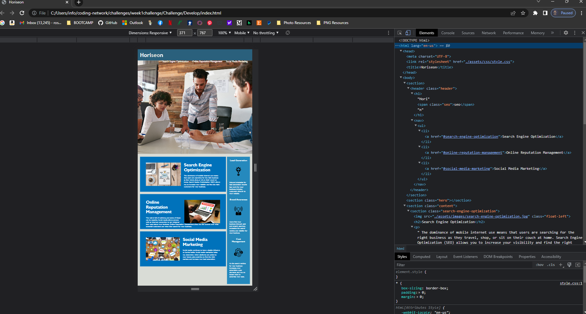

# Week 1 Challenge	

## Description

- Goal was to modify code in order to create accessible HTML. 
- This project was completed in order to provide accessibility for individuals with disabilities who use screen readers, video captions, and braille keyboards. 
- Doing this helped this site rank higher in search engines. It also helps to avoid litigation, and allows individuals with disabilities to view the website. 
- I learned the importance of creating semantic HTML to include all in the development process. 

## Installation

Navigate to week1challenge/Challenge/Develop/index.html

## Usage

Provide instructions and examples for use. Include screenshots as needed.
The site provides information about the company and what services they provide. 

## Credits

https://github.com/the-Coding-Boot-Camp-at-UT/UTA-VIRT-FSF-PT-10-2022-U-LOLC

